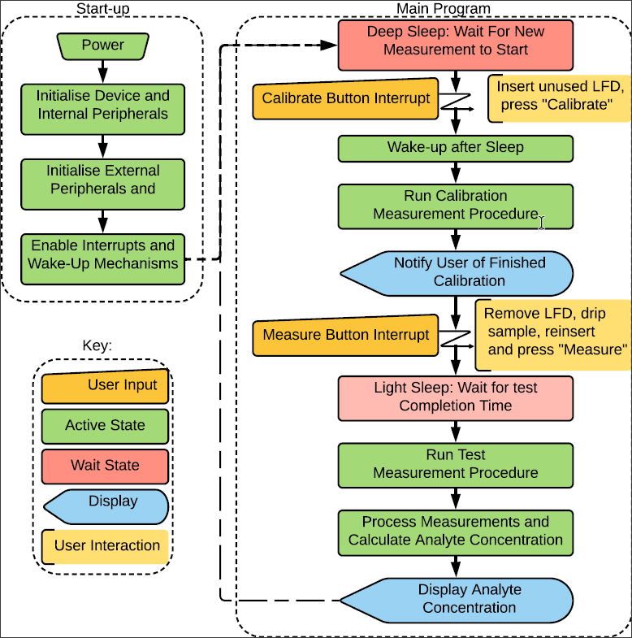
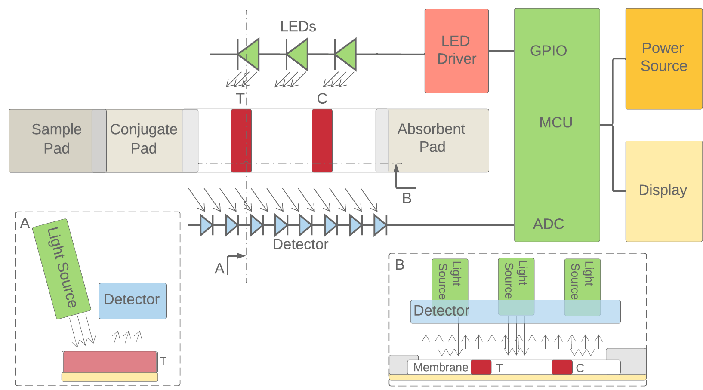

# Lateral Flow Device Reader to Quantify Pathogenic Bacteria
## Masters Project at University of York by Herman Larsen

## Overview 
Development and optimisation of hardware, embedded software and mechanical design was performed for a system measuring space-resolved reflectance in LFDs to quantify the amount of a biomarker, used to indicate desease and conditions.
The prototype improves on previous designs to allow for lower power consumption, generic use and standardisation in areas of medicine and research. 
The project demonstrates that a cheap and rapid device can perform quantitative analysis of LFDs

## Functionality

The software is part of an embedded system, designed to integrate with synchronously designed hardware.

It enables measurements of LFD using space-resolved reflectance of LFDs before and after test line development to quantify the concentration of the LFD specific biomarker.

## Software Implementation

More information for each file can  be found in each .c/.h file.

Specifically developed project files:
+ main.c (System Initialisation, Setup and measurement code)
+ ccd_sensor.c (CCD Sensor driver, reading and testing for LFD test line scans)
+ interrupts.c (Interrupts for the project, including timers, and allows the system to wake from asynchronous button presses and maintain the direct memory transfer from the ADC peripheral to a chosen memory location.  )
+ utilities.c (Functions utilised in the main related to arithmetic and DSP operations such as peak finding, as well as printing of the CCD output.)
+ low_power.c (Functions for putting the MCU into a low power mode or deep sleep, allowing for a significant reduction in power consumption.)

### Python Logging Scripts
3 scripts also exist used to 
+ log quickly in short burst
+ log less quickly over long intervals over hours or days
+ graph live output from MUC

## Operation 
The overall software and device operation is described the following images or links, describing:
1. Device Operation Overview Image 
2. System Concept 
3. [Operation of Calibration and Test Measurements](./.readmePhotos/OperationMeasurements.pdf)
4. [Operation of CCD Calibration](./.readmePhotos/OperationCCDcalibration.pdf)
5. [Operation of CCD Read and Clear](./.readmePhotos/OperationCCDClearRead.pdf)

## Required Software and Driver Overview
The following contains links to necessary software and drivers as well as useful information when programming. 
The ST website has an extensive database of technical information and software, but navigating the extensive database can be overwhelming.
Here are the drivers and software of interest, all apart from the ARM IDE which are from the ST website.
The tool flow is described on [Tool FLow Description](https://www.st.com/en/development-tools/stm32-software-development-tools.html?querycriteria=productId=SC2106)

### ARM Microcontroller Developer Kit, uVision IDE. 
This is the IDE used through development. Free version was used available from: http://www2.keil.com/mdk5/.
The STM32F446RE ARM Cortex-M4 MCU was used.

### The STM32CubeMX
STM32CubeMX software was used for setup and configuration of the board in unison with the Keil uVision IDE:
[STM32 Dev Tools](https://www.st.com/content/st_com/en/products/development-tools/software-development-tools/stm32-software-development-tools/stm32-configurators-and-code-generators/stm32cubemx.html)

### PuTTY 
Putty was used for serial communication with the board when not graphing or logging.
The com port name can be found in device manager, and the conenction baudrate(speed) is 115200 (further details can be found inside the actual code in usart.c|h).
For the communication used in this project, the serial was setup with 8 data bits, 1 stop bit, no parity and flow control set to XON/XOFF (putty serial settings).

### Drivers and useful downloads:

#### ST Link Utility, Memory access and Firmware Upgrade, including Virtual COM port drivers for the MCU:
MCU is already upgraded in firmware, so barebones driver below should be sufficient.
[ST Link Utility](https://www.st.com/content/st_com/en/products/development-tools/software-development-tools/stm32-software-development-tools/stm32-programmers/stsw-link004.html)

#### Bare bones Virtual COM port driver required to communicate over serial with the MCU:
[STM Dev Tools](https://www.st.com/content/st_com/en/products/development-tools/software-development-tools/stm32-software-development-tools/stm32-utilities/stsw-link009.html)
The MCU used, the STM32F446RE, has the ST-LINK/V2-1.

#### Firmware Examples and Info for various nucleo boards:
[STM Examples](https://www.st.com/content/st_com/en/products/embedded-software/mcu-mpu-embedded-software/stm32-embedded-software/stm32cube-mcu-mpu-packages/stm32cubef4.html)

#### Useful links for finding information on the board and related content:
+ MCU Overview: [STM Overview](https://www.st.com/en/microcontrollers-microprocessors/stm32f4-series.html?querycriteria=productId=SS1577)

+ Technical Information and Software: [STM Info Search](https://www.st.com/content/st_com/en/support/support-home.html?querycriteria=productId=SS1577resourceCategory=technical_literatureresourceType=application_note)  (The top search field is your friend)
	
	- Pay special attention to the main reference manual and datasheet, "STM32f446RE Advanced Reference Manual, RM0390" and "STM32f446RE Datasheet", which are necessary in programming or using low-level peripherals. Other datasheets can be useful for reference.# LFD_Reader

